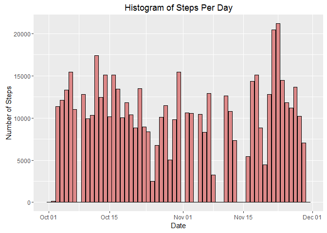
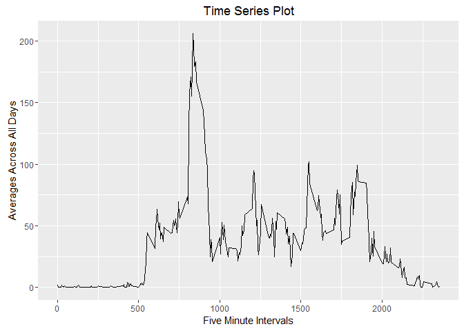
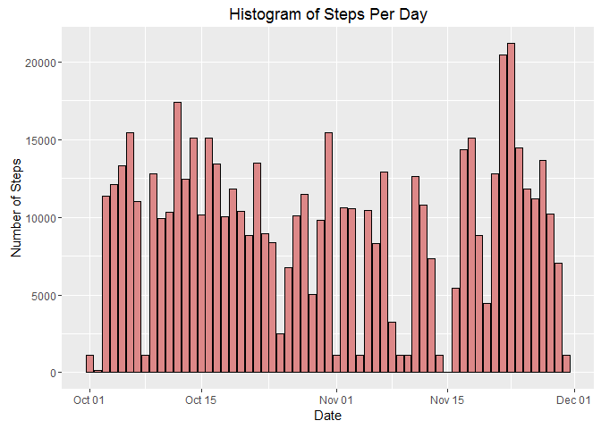
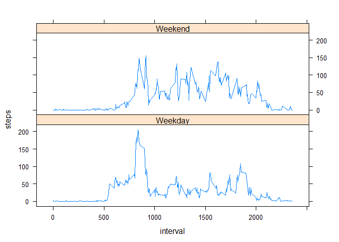

# Reproducible Research: Peer Assessment 1

<br>

## Loading and preprocessing the data
<br>


```r
if(!file.exists("activity.zip"))
    stop("Can't find activity.zip")

unzip("activity.zip")

library(data.table)
library(lubridate)

dat <- fread("activity.csv", na.strings="NA")
dat$date <- ymd(dat$date)
```

<br>

## What is mean total number of steps taken per day?
<br>

Make a histogram of the total number of steps taken each day.


```r
library(ggplot2)
by.day <- dat[, .(steps=sum(steps, na.rm=TRUE)), by=date]

ggplot(data=by.day, aes(x=date, y=steps)) + 
    geom_bar(colour="black", fill="#DD8888",stat="identity") + 
    guides(fill=FALSE) +
    xlab("Date") + ylab("Number of Steps") +
    ggtitle("Histogram of Steps Per Day")
```

 

```r
mean.steps <- mean(by.day$steps, na.rm=TRUE)
median.steps <- median(by.day$steps, na.rm=TRUE)
```


Mean total number of steps: 9354
<br>
Median total number of steps: 10395

<br>

## What is the average daily activity pattern?
<br>
1. Make a time series plot (i.e. type = "l") of the 5-minute interval (x-axis)
and the average number of steps taken, averaged across all days (y-axis)
<br><br>


```r
by.interval <- dat[, .(steps=mean(steps, na.rm=TRUE)), by=interval]

qplot(by.interval$interval, by.interval$steps, geom="line",
      main="Time Series Plot", xlab="Five Minute Intervals", ylab="Averages Across All Days")
```

 

<br>
2. Which 5-minute interval, on average across all the days in the dataset,
contains the maximum number of steps?
<br>


```r
max.steps = max(by.interval$steps)
max.interval <- by.interval[by.interval$steps == max.steps]$interval
```

* Answer: 835
    * max.steps = 206.1698113
    * max.interval = 835
        
        ```r
        by.interval[interval==max.interval,]
        ```
        
        ```
        ##    interval    steps
        ## 1:      835 206.1698
        ```
<br>

## Imputing missing values

<br>
Find indices for missing data


```r
na.indices <- which(!complete.cases(dat))
```

Number of observations with missing data: 2304

Create a copy of the original dataset and replace missing values with median by interval.


```r
interval.day.steps <- dat[,.(date,steps, med=median(steps, na.rm=T)), by=interval]
na.indices <- which(is.na(interval.day.steps$steps))
interval.day.steps[na.indices, steps:=med]
newdat <- interval.day.steps[,.(steps,date,interval)]
```

Make a histogram of the total number of steps taken each day.


```r
new.by.day <- newdat[, .(steps=sum(steps, na.rm=TRUE)), by=date]

ggplot(data=new.by.day, aes(x=date, y=steps)) + 
    geom_bar(colour="black", fill="#DD8888",stat="identity") + 
    guides(fill=FALSE) +
    xlab("Date") + ylab("Number of Steps") +
    ggtitle("Histogram of Steps Per Day")
```

 

```r
new.mean.steps <- mean(new.by.day$steps, na.rm=TRUE)
new.median.steps <- median(new.by.day$steps, na.rm=TRUE)
```


New mean total number of steps: 9504
<br>
New median total number of steps: 10395

Do these values differ from the estimates from the first part of the assignment?

* They are only sligtly different.

What is the impact of imputing missing data on the estimates of the total
daily number of steps?

* Some bins that had zero values now have the median value.
* The mean total number of steps is slightly larger.
<br><br>

## Are there differences in activity patterns between weekdays and weekends?
<br>
Create a new factor variable in the dataset with two levels – “weekday”
and “weekend” indicating whether a given date is a weekday or weekend
day.


```r
weekday.indices <- which(!(weekdays(newdat$date) %in% c("Saturday", "Sunday")))
weekend.indices <- which(weekdays(newdat$date) %in% c("Saturday", "Sunday"))

newdat[weekday.indices, day:=as.factor("Weekday")]
newdat[weekend.indices, day:=as.factor("Weekend")]
```

Make a panel plot containing a time series plot (i.e. type = "l") of the
5-minute interval (x-axis) and the average number of steps taken, averaged
across all weekday days or weekend days (y-axis).


```r
library(lattice)

steps.days <- aggregate(steps ~ interval + day, data=newdat, FUN=mean)

xyplot(steps ~ interval | day, steps.days, type = "l", layout = c(1, 2))
```

 
